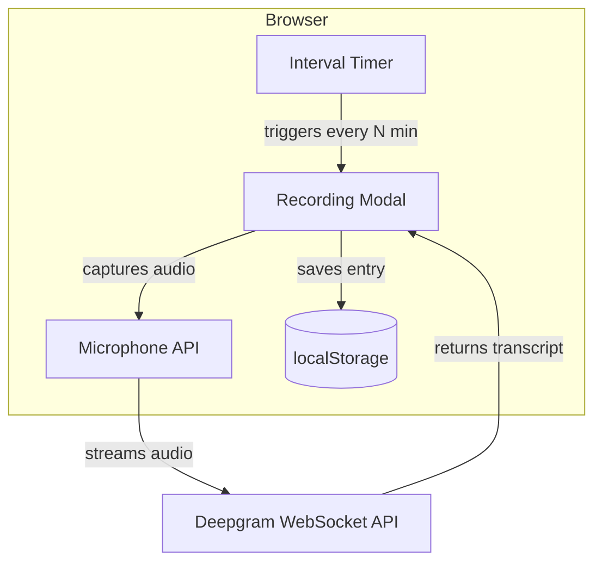

# Time Audit App

## Architecture

A single-page web application with no server-side code. All data stays in the browser using localStorage.




## Tech Stack

- **Vanilla HTML/CSS/JavaScript** - No build step required, simple to deploy
- **Deepgram SDK via CDN** - `https://cdn.jsdelivr.net/npm/@deepgram/sdk` for real-time speech-to-text
- **localStorage** - Persist API key, settings, and transcripts

## Key Features

1. **First-run setup**: Modal to enter Deepgram API key (stored in localStorage)
2. **Configurable interval**: Dropdown to select 10, 15, 20, or 30 minutes
3. **Recording popup**: Modal with start/stop recording, live transcript preview
4. **Transcript log**: Scrollable list of timestamped entries with time ranges
5. **Export option**: Download transcripts as JSON or text file

## File Structure

```
time-audit/
├── index.html      # Main HTML structure
├── style.css       # Modern, clean styling
├── app.js          # Core application logic
└── README.md       # Setup instructions
```

## Core Implementation Details

### Timer and Notification

- Use `setInterval()` with the selected interval
- Show a modal popup when timer fires
- Play a subtle audio notification to alert the user
- Pause timer while recording is active

### Speech-to-Text Integration

Using Deepgram's browser SDK with live transcription:

```javascript
const { createClient, LiveTranscriptionEvents } = deepgram;
const client = createClient(apiKey);
const connection = client.listen.live({
  model: "nova-3",
  smart_format: true,
  interim_results: true,
});
```

### Data Storage Schema

```javascript
// localStorage keys
{
  "timeaudit_apikey": "dg-xxxx",
  "timeaudit_interval": 15,
  "timeaudit_entries": [
    {
      "id": "uuid",
      "startTime": "2026-02-05T10:00:00Z",
      "endTime": "2026-02-05T10:15:00Z",
      "transcript": "Worked on the API integration...",
      "recordedAt": "2026-02-05T10:15:30Z"
    }
  ]
}
```

### UI Components

1. **Settings Panel** (top bar)
  - Interval selector dropdown
  - API key management (show/hide, update)
  - Next prompt countdown
2. **Recording Modal**
  - Time period being reported (e.g., "10:00 - 10:15")
  - Microphone status indicator
  - Live transcript preview
  - Save/Cancel buttons
3. **Transcript Log** (main area)
  - Chronological list of entries
  - Each entry shows time range and transcript
  - Delete individual entries
  - Export all button

